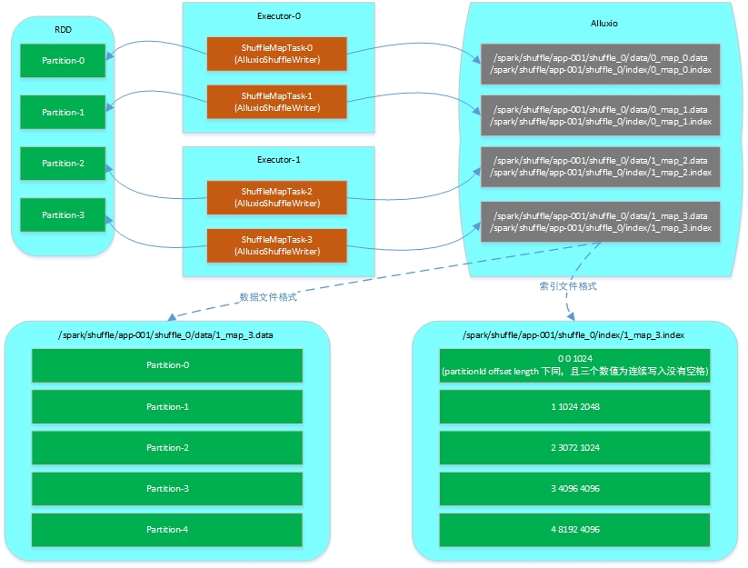
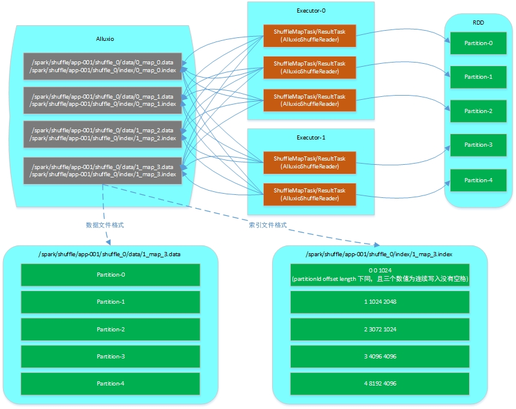

# 概述

Spark当前版本中shuffle环节都避免不了要将shuffle数据落磁盘，所以当整个application的运行过程中如果产生过多的shuffle数据并且落磁盘的话会对整体的性能带来一定的影响，且该影响会随着shuffle数据的增多而增加。所以该环节还有很大的优化空间。  

基于该问题的背景和现状，我们考虑将shuffle数据输出到更快速的缓存或者文件系统中，经过调研和对比，我们选择了Alluxio来存储shuffle数据，使用Alluxio主要是考虑到如下几点：

* Alluxio主要是基于内存的分布式文件系统，相比其它基于磁盘的文件系统来说其具有更好的性能
* Alluxio本身还提供了持久化Spark RDD的功能，在此基础上增加对shuffle数据的存储使得其与Spark的集成更紧密
* Alluxio还具备可扩展性和容错性，并且提供了简易的API供用户使用，以及其健康的社区发展

# 设计与实现

在了解了Spark的shuffle环节的大体实现后，可以看出来Spark官方是有意后续完善shuffle环节的，因此对于shuffle管理部分的ShuffleManager实现了插件化。使用者完全可以根据自己的需求实现一套ShuffleManager，然后根据设置 `spark.shuffle.manager` 参数来替换Saprk默认的SortShuffleManager。

根据上述的情况我们基于Alluxio实现了一套AlluxioShuffleManager，该ShuffleManager目前主要实现了ShuffleWrite以及ShuffleRead的功能，并且在设计时参考了SortShuffleManager的实现思路，避免了因为扩展带来的Shuffle数据文件急速膨胀的问题，下面依次介绍各个功能环节的具体设计和实现细节。

## Shuffle Write

在Spark的实现中，每个RDD逻辑上分为多个partition，而每个partition的数据仅由一个Task来处理。在Shuffle Write环节则是由ShuffleMapTask来处理具体的partition数据，在ShuffleMapTask的runTask方法中可以看到通过ShuffleManager获取writer并写入数据的过程，如下：

    val manager = SparkEnv.get.shuffleManager
    writer = manager.getWriter[Any, Any](dep.shuffleHandle, partitionId, context)
    writer.write(rdd.iterator(partition, context).asInstanceOf[Iterator[_ <: Product2[Any, Any]]])
    writer.stop(success = true).get

所以对于Shuffle Write环节来说，每个ShuffleMapTask的输入即为RDD的一个partition，输出则是由具体的ShuffleWriter实现来决定。  
**在我们的AlluxioShuffleWriter实现中则是把partition中的每个record根据ShuffleDependency中的partitioner对record的key进行计算后将record输出到新的partition中，并且每个ShuffleMapTask中的AlluxioShuffleWriter将产生的新的多个partition的数据全部输出到一个文件内，且多个partition的写入顺序是根据partitionId排序过的，然后在写入partition数据的同时还会生成一个索引文件用来记录每个partition在数据文件中的偏移量和长度。该种写入方式的思路参考了spark的SortShuffleManager，这样可以避免因为扩展带来的shuffle数据文件数目急速膨胀的问题，最终的shuffle数据文件数目仅会和具体的ShuffleMapTask的数目保持一致。** 

综上所述，AlluxioShuffleWriter的输入输出如下所示：

* **输入**  
RDD中的一个partition

* **输出**  
Alluxio中的文件：   
	1. 其中shuffle数据文件全路径命名如：/spark/shuffle/${**appId**}/shuffle\_${**shuffleId**}/data/${**executorId**}\_map\_${**mapId**}.data，文件内容则为根据partitionId排序后写入的经过序列化后的KVKV...这样格式的数据。
	2. 其中shuffle索引文件全路径明明如：/spark/shuffle/${**appId**}/shuffle\_${**shuffleId**}/index/${**executorId**}\_map\_${**mapId**}.index，文件内容则为根据数据文件写入的partition顺序对应的每个partition的索引数据，每个partition的索引数据由一个Int和两个Long组成（通常在64位操作系统上为20个字节），依次表示为partitionId、offset、length，其中offset表示的是该部分数据在partition文件中的起始偏移位置，length则表示的该部分数据的长度。

其中输入RDD partition以及ShuffleMapTask和ShuffleWriter、以及输出Alluxio文件等的结构关系图如下所示：

**在上图中：**  
* 每个ShuffleMapTask仅处理RDD中一个partition的数据；  
* 每个ShuffleMapTask中的AlluxioShuffleWriter将新生成的partition的数据写入对应的Alluxio文件中，并生成对应的索引文件；  
* 数据文件内的partition数据是根据partitionId排序后连续依次写入的；  
* 索引文件内的索引数据也是根据partitionId排序后连续依次写入的，其中每块索引数据记录了partitionId、offset、length；  
* 整个过程中不需要并发访问的同步控制等操作；

## Shuffle Read

对于Shuffle Read环节，除了从Alluxio获取目标文件的输入文件流操作外，此处并没有做太多的修改，而是复用了Spark中BlockStoreShuffleReader的代码（但是没有对输入文件流做压缩，输出写到文件里进行了压缩，为什么获取输入流后还是压缩而不是解压？？）。  
  
### 问题1
但是从Alluxio获取目标文件的输入文件流时，我们又面临了一个棘手的问题：  
**因为Shuffle Read环节需要读入的是一个完整的partition的数据，从上面的Shuffle Write小节可知我们已经将每个新产生的partition数据写到了所有的Shuffle Write的数据文件中，即每个数据文件中都有目标partition的一部分数据，因为Alluxio提供的Client API只能针对具体的一个文件进行操作，所以为了完成一个Shuffle Read环节我们就需要打开所有的数据文件。从测试结果来看，该种实现方案性能极差，针对24GB数据集的WordCount测试，Shuffle Read环节要耗费20多分钟，所以该种方案完全不可取。**  

为了解决上述问题，我们对Alluxio的Client API以及其文件对应的底层结构进行了分析，分析结果如下：  
1. 通过如FileInStream等API去读取文件数据时，实际上会转换为构造LocalFileBlockReader或者RemoteNettyBlockReader从本地或者远程读取数据；  
2. 每个File逻辑上是由一个或者多个Block组成，而每个Block又会对应到本地的一个文件（Alluxio中默认会使用ramfs创建文件）；

经过上述的分析，我们考虑直接来读取每个文件对应的Block的数据片段（即每个partition所在Block的一段数据），而不再通过如FileInStream等API进行间接读取数据。一方面是因为每次构造FileInStream都会进行buffer缓冲申请，当文件数过多时造成了内存资源方面的浪费；令一方面是过多的Client连接Alluxio会对其造成更大的冲击，对其稳定性带来影响。所以，我们在此基础上在Alluxio中扩展了一个Client API（命名为MultiBlockInStream）。该类的主要功能是直接将分布在一台或者多台Alluxio Worker服务器上的不连续且不相关的Block数据块进行统一管理，对使用者透明，仍像是读取一个文件。  

### 问题2
通过实现MultiBlockInStream，我们将Shuffle Read环节的耗时从20多分钟减少到了20几秒，证明了我们直接操作Block数据这个方向的正确性。但是该性能与spark的SortShuffleManager在Shuffle Read环节的性能相比仍然相差三倍以上。  

继续对spark的SortShuffleManager的Shuffle Read环节进行分析发现，其读取远端服务器的数据时针对每个远端服务器都是尽可能的一次通信就把所有数据拉回来（每次拉取数据量默认不会超过48MB的五分之一）；而对我们扩展的MultiBlockInStream进行分析后可知，虽然是直接对Block数据进行读取，但是针对远端服务器的Block，有多少个Block数据需要读取就要执行多少次RPC，相比spark的实现确实是造成了很多开销。以测试的WordCount来看，需要执行几百次的RPC来读取Block数据，可想而知和调用两三次相比的开销差距。  

带着上述问题，我们又深入了解了目前Alluxio实现的RPC，但是很遗憾并没有一次性可读取多个Block数据片段的RPC，因此我们又在此基础上扩展了一个读取多个Block数据片段的RPC（命名为RPCMultiBlockReadRequest，对应的响应为RPCMultiBlockReadResponse）。结合我们扩展的MultiBlockInStream便可以一次性尽可能多的从远端服务器中读取多个Block的数据片段。  

并且经过测试验证，该种实现方案将Shuffle Read环节的速度又提升了两倍多，相比spark的SortShuffleManager仅慢了约20%多，且应该还有进一步优化的空间。

* **输入**  
Alluxio上所有Shuffle数据文件中对应的partition数据片段

* **输出**  
输出则为RDD的一个partition的iterator，对应的类型为Iterator[Product2[K, C]]

其中输入Alluxio文件、AlluxioShuffleReader以及输出的RDD partition之间的关系如下图所示：

## 配置  

AlluxioShuffleManager提供了如下配置项供选择：

    spark.alluxio.block.size （默认值为512）:  				
    	生成的Alluxio文件的block size，单位为MB  

    spark.alluxio.memory.only （默认值为true）:  
        Alluxio生成文件时是否只使用内存进行存储，不进行异步落磁盘，默认为true  

    spark.alluxio.read.without.cache （默认值为true）:		
        当读取Alluxio文件时是否不将远端的数据缓存到本地，默认为true  

    spark.alluxio.master.host :				
        Alluxio Master的地址，格式如alluxio://10.0.2.21:19998，目前AlluxioShuffleManager仅支持Alluxio StandAlone模式的Master地址配置  

    spark.alluxio.read.all.by.remote.reader （默认值为false）:	
       通过Alluxio进行ShuffleRead时是否全部通过使用Netty的RemoteReader读取数据，如果全部通过RemoteReader读取数据可以避免读取本地时去锁具体的Block且每次调用仅能读取一个Block的数据。  
    
    spark.alluxio.file.buffer.bytes （默认值为1MB）:  
       通过Alluxio进行ShuffleRead时会先将远端数据读到buffer中，这个buffer的size决定了可以一次从远端读取多少数据，如果一次读的越多则会执行更少的RPC。

还有使用AlluxioShuffleManager必须要配置的一项为：  

    spark.shuffle.manager : 				
        设置值为org.apache.spark.shuffle.alluxio.AlluxioShuffleManager

*注意：在使用AlluxioShuffleManager时会需要一些依赖的jar包，可在发布时直接将alluxio-core-client-1.3.0-jar-with-dependencies发布到spark的jars目录下即可，同时还包括alluxio-shuffle-manager-1.0-SNAPSHOT.jar。*

## TODO

* **容错性**

目前AlluxioShuffleManager在容错性方面还没有更深入的测试，理论上是可以依靠Alluxio本身提供的容错功能来保证数据不丢失，还需要进一步测试验证。

* **进一步优化**
  
目前0.2版本的AlluxioShuffleManager的实现还有待从实现逻辑上进一步优化。

* **稳定性以及性能测试**  

需要补充大规模长时间的稳定以及性能测试。

