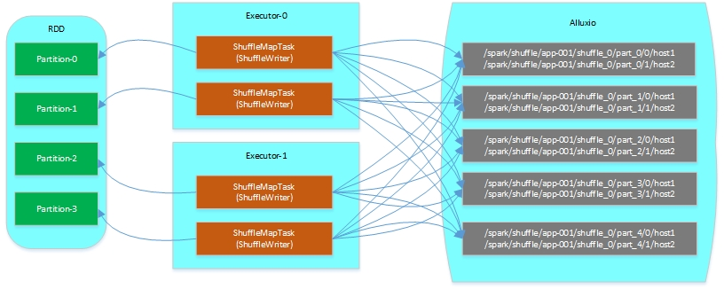
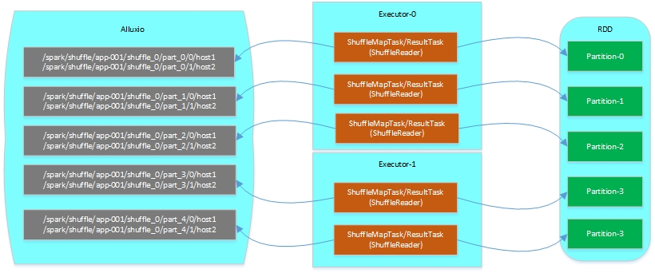

# 概述

Spark当前版本中shuffle环节都避免不了要将shuffle数据落磁盘，所以当整个application的运行过程中如果产生过多的shuffle数据并且落磁盘的话会对整体的性能带来一定的影响，且该影响会随着shuffle数据的增多而增加。所以该环节还有很大的优化空间。  

基于该问题的背景和现状，我们考虑将shuffle数据输出到更快速的缓存或者文件系统中，经过调研和对比，我们选择了Alluxio来存储shuffle数据，使用Alluxio主要是考虑到如下几点：

* Alluxio主要是基于内存的分布式文件系统，相比其它基于磁盘的文件系统来说其具有更好的性能
* Alluxio本身还提供了持久化Spark RDD的功能，在此基础上增加对shuffle数据的存储使得其与Spark的集成更紧密
* Alluxio还具备可扩展性和容错性，并且提供了简易的API供用户使用，以及其健康的社区发展

# 设计与实现

在了解了Spark的shuffle环节的大体实现后，可以看出来Spark官方是有意后续完善shuffle环节的，因此对于shuffle管理部分的ShuffleManager实现了插件化。使用者完全可以根据自己的需求实现一套ShuffleManager，然后根据设置`spark.shuffle.manager`参数来替换Saprk默认的SortShuffleManager。

根据上述的思路我们基于Alluxio实现了一套AlluxioShuffleManager，该ShuffleManager目前主要实现了ShuffleWrite以及ShuffleRead的功能，但是对于容错以及可扩展方面的考虑还稍有欠缺（后面会详细介绍），下面依次介绍各个功能环节的具体设计和实现细节。

## Shuffle Write

在Spark的实现中，每个RDD逻辑上分为多个partition，而每个partition的数据仅由一个Task来处理。在Shuffle Write环节则是由ShuffleMapTask来处理具体的partition数据，在ShuffleMapTask的runTask方法中可以看到通过ShuffleManager获取writer并写入数据的过程，如下：

    val manager = SparkEnv.get.shuffleManager
    writer = manager.getWriter[Any, Any](dep.shuffleHandle, partitionId, context)
    writer.write(rdd.iterator(partition, context).asInstanceOf[Iterator[_ <: Product2[Any, Any]]])
    writer.stop(success = true).get

所以对于Shuffle Write环节来说，输入即为RDD的一个partition，输出则是由具体的ShuffleWriter实现来决定。  
在我们的AlluxioShuffleWriter实现中则是把partition中的每个record根据ShuffleDependency中的partitioner对record的key进行计算后将record输出到新的partition中，其中每个partition是由多个Alluxio文件组成，而partition中的Alluxio文件数量则是由执行Application时的executor数目决定。（从这个实现的描述中我们可以看出，在随着集群的扩展，即使partition数目不变，但是由于executor数目在不断增长会导致输出的每个partition中的Alluxio文件相应的增加，在后面**存在问题**小节中我们会详细介绍下可能存在的弊端以及优化方案） 

综上所述，AlluxioShuffleWriter的输入输出如下所示：

* **输入**  
RDD中的一个partition

* **输出**  
Alluxio中的文件，其中文件全路径命名如：/spark/shuffle/${**appId**}/shuffle_${**shuffleId**}/part_${**partitionId**}/${**executorId**}_${**hostName**}，文件内容则为经过序列化后的KVKV...这样的格式。

其中输入RDD partition以及ShuffleMapTask和ShuffleWriter、以及输出Alluxio文件等的结构关系图如下所示：
  

**在上图中：**  
* 每个ShuffleMapTask仅处理RDD中一个partition的数据；  
* 每个ShuffleMapTask中的ShuffleWriter可能根据ShuffleDependency的partitioner将数据写到任意一个partition中；  
* 同一个Executor内的不同ShuffleMapTask往同一个partition写数据时只会写到同一个文件中，即每个partition内的一个文件对应一个Executor，而该Executor内的所有ShuffleWriter都将数据写到这一个文件中。其中多个ShuffleWriter并发访问的控制通过synchronized实现；

## Shuffle Read

对于Shuffle Read环节，此处并没有做太多的修改，而是复用了Spark中BlockStoreShuffleReader的代码（但是没有对输入文件流做压缩，输出写到文件里进行了压缩，为什么获取输入流后还是压缩而不是解压？？）。  

每个AlluxioShuffleReader构造时会传入需要读取的partition的起始id和结束id，基于上述Shuffle Write环节每个partition下的文件数目是以Executor的数量为依据的前提，每个Task（ShuffleMapTask或者ResultTask）中的AlluxioShuffleReader会读取指定partition下所有Executor文件（即同时打开多个FileInStream），后面的处理逻辑则完全复用BlockStoreShuffleReader的代码。

* **输入**  
Alluxio上一个partition目录下的所有Executor创建的文件

* **输出**  
输出则为RDD的一个partition的iterator，对应的类型为Iterator[Product2[K, C]]

其中输入Alluxio文件、ShuffleReader以及输出的RDD partition之间的关系如下图所示：

## 存在问题

* **扩展带来的问题**  

在上面Shuffle Write小节中我们提到了当前的实现方式存在的问题：即在随着集群规模扩展，运行Application的Executor数目增加时，会导致Shuffle环节输出的文件增多，虽然这种每个executor对应一个文件的方式可以缓解并发访问带来的冲突问题，但是如果集群规模增加到一定程度时，该方面可能会对Alluxio集群带来一定的影响。那么为什么会得出如此结论呢？  

在开始实现基于Alluxio的ShuffleManager时，我们尝试将每个ShuffleMapTask输出的每个partition的数据都单独生成一个Alluxio的文件。如果ShuffleMapTask的数目是`m`，输出的partition数目是`n`，则将产生`m*n`个文件，这种实现方式和spark最初的Hash版的ShuffleManager很相似，但是事实证明该种方式的性能很差，比如严重的GC问题、以及因为创建过多的Alluxio文件导致JVM抛出OOM（具体原因通过简单定位可能主要是来自于写文件时要申请缓冲区，因为文件过多导致申请的缓冲区过大从而内存溢出）等，经过考虑后将上述实现逻辑进行调整，将一个partition下的文件按照executor来划分，来自于同一个Executor内的ShuffleMapTask通过synchronized来进行并发访问控制。经验证，该种方式在我们的测试环境下性能得到了改善，并且在某些特定的场合下可以达到相比于Spark的SortShuffleManager的30%提速。 

如果以相同的测试数据集以及测试条件来考虑随着集群规模扩展带来的问题，可以得到如下结论：  
1. 随着集群规模的增加，从Spark方面考虑：测试数据集不变，对应的测试Application的并行度增加，即Executor数目增加；但相应的Executor中的ShuffleMapTask数目减少，降低了每个Executor中的开销以及并发访问的冲突，Executor本身的性能应该会有提升；  
2. 随着集群规模的增加，从Alluxio方面考虑：测试数据集不变，由于Application对应的Executor数目增加，会导致生成的文件数目变多，但是每个文件内容相对变少，此时对于Alluxio Master的压力会随着客户端数目的增加而增大，但是性能走势未知。

所以，在集群规模扩展时性能方面存在不确定性的因素，为了防止并解决上述问题，可以做出如下考虑：  
1. 验证Alluxio是否会随着客户端的增加而导致性能下降；  
2. 验证Alluxio是否会随着写入更多的小文件导致性能下降；  
3. 如果上述1或2存在，可以考虑针对每个partition只创建一个文件，但这样就涉及到跨节点之间并发访问Alluxio的文件，此时需要Alluxio提供这样的支持，否则无法做到。目前Alluxio提供的文件操作流都是非线程安全的，需要扩展实现线程安全的文件操作API。

* **容错性**

目前AlluxioShuffleManager还不具备容错性方面的能力。需要在了解Spark的SortShuffleManager是如何实现容错后，再考虑如何做。

* **Shuffle数据清理**

目前AlluxioShuffleManager对于Shuffle数据的清理主要在Shuffle注销以及ShuffleManager停止并退出时两个环节进行。其中Shuffle注销时仅清理对应Application的指定Shuffle Id下的数据；而ShuffleManager退出时则是将整个Application对应的Shuffle数据全部清理掉。如果在Spark的Application中跳过了这两个步骤，则Shuffle数据将不会被自动清理，仅能手动删除。通常Spark会对每个Application的Driver的shutdown添加hook，以确保在Driver退出时可以对临时数据做清理。

* **Shuffle Write文件的close时机**

AlluxioShuffleManager在实现Shuffle Write环节时，是在初始获取ShuffleWriters的时候就创建好了每个Partition下对应的Executor文件，每个Executor文件都可能被该Executor内的所有ShuffleWriter所访问（通过synchronized进行并发控制），也正因为该种实现方式导致在每个ShuffleWriter数据写完之后，不知道是否还有其它ShuffleWriter要继续写数据，所以不能立即将该文件关闭，这样即使最后一个ShuffleWriter也写完了数据，但它仍不知道是否应该关闭文件，所以也只能选择不关闭。当Shuffle Write过程所有Task都写完数据后Stage又会继续执行Shuffle Read环节，但是由于Shuffle Write环节所有的Task写完数据后都没有关闭文件，导致通过Alluxio API去open文件读取数据时读不到内容。  

为了解决上述问题，AlluxioShuffleManager目前采用的方式是在进入Shuffle Read环节获取ShuffleReader时去close所有属于该Executor内打开的Alluxio文件以确保ShuffleReader可以读到数据。但是这只能保证属于该Executor内打开的文件被关闭，因为ShuffleReader在读数据时是去读Partition下的所有Executor创建的文件，其中包含了不属于ShuffleReader所处Executor的其它Executor所创建的文件，这样就没办法保证在关闭该Executor创建的文件的同时其它Executor创建的文件也被关闭。为了尽可能的确保在ShuffleReader读数据时所有Executor都已经把创建文件关闭，在ShuffleReader去open文件之前先去查看文件长度是否为0，只有在不为0的情况下才立即返回，否则会sleep 100毫秒并重复检查5次，如果5次检查都为0则打印warn日志说明当前状况。

## TODO

1. 上述存在问题解决
2. 稳定性和性能测试

